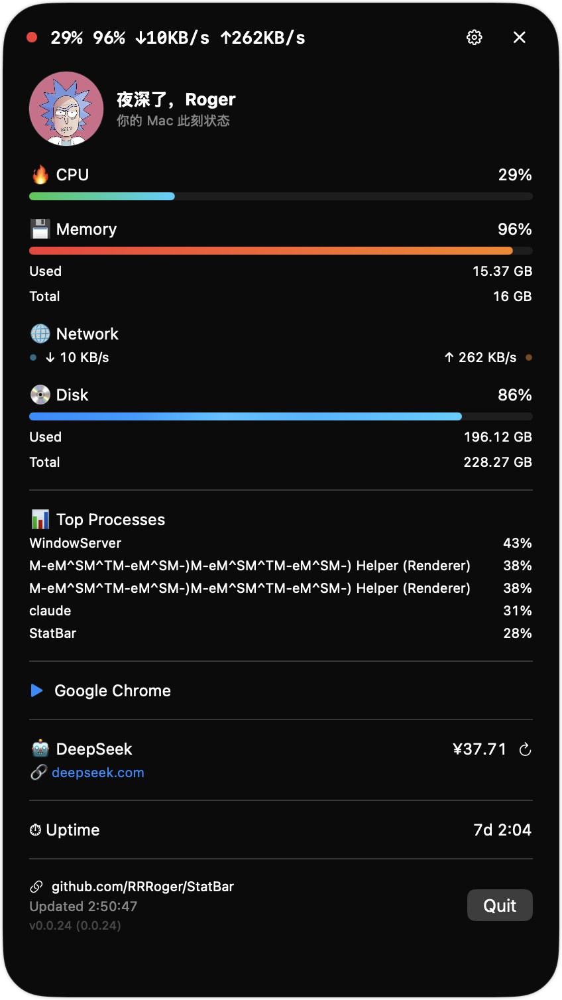

# StatBar

macOS 灵动岛风格系统监控工具，悬浮在屏幕顶部中央，实时显示系统状态。



## 功能

### 灵动岛

**紧凑态：** `头像 🔥23% 💾58% 🌐↓1.2MB/s↑300KB/s [三体动画]`
- 显示 CPU、内存、网速（完整单位）
- 右侧三体引力轨道动画（青/橙/粉三色）
- 高负载时红色呼吸光环 + 渐变光晕
- 视频播放时显示 ▶️ 图标

**展开态（点击展开）：**
- CPU / 内存 / 磁盘：渐变进度条 + 流光动画
- 网络：上下行速率 + 脉冲指示灯
- 电池：电量、循环次数、健康状态
- Top 5 进程（按 CPU 排序，纯进程名）
- 🤖 DeepSeek 账户余额（支持设置页配置 API Key + 测试连接）
- 系统运行时长
- 视频播放检测（Safari/Chrome/IINA/VLC 等）

### 设置面板

- **菜单栏**：各项显示开关 + 样式切换（emoji / 标签 / 数字）
- **刷新频率**：低功耗(5s) / 标准(2s) / 高频(1s)
- **告警阈值**：CPU / 内存 / 磁盘 / DeepSeek 余额
- **个人信息**：昵称、副标题、头像路径（支持浏览选择）
- **DeepSeek**：API Key 配置 + 测试连接

## 技术栈

- Swift 6 / SwiftUI
- macOS 15+ 原生 App（无 Dock 图标）
- 无需 Xcode，Swift Package Manager + Command Line Tools 即可构建
- NSPanel 实现悬浮灵动岛效果

## 本地运行

```bash
# 运行测试（39 个）
swift test

# 构建
swift build

# 打包 .app（自动递增版本号）
./scripts/build-app.sh

# 部署到 Applications 并启动
pkill -f StatBar 2>/dev/null; sleep 0.3
./scripts/build-app.sh && rm -rf /Applications/StatBar.app \
  && cp -R .build/StatBar.app /Applications/StatBar.app \
  && open /Applications/StatBar.app
```

## 配置 DeepSeek 余额显示

两种方式（二选一）：

1. **设置页**：打开设置 → DeepSeek → 输入 API Key → 测试连接
2. **环境变量**：`launchctl setenv DEEPSEEK_API_KEY "sk-你的key"`

## 项目结构

```
Sources/StatBar/StatBarApp.swift        # 灵动岛面板、设置窗口、三体动画
Sources/StatBarCore/
  SystemMetrics.swift                   # 数据模型、Formatter、CPU 计算器
  SystemInfoProviders.swift             # 系统指标采集（CPU/内存/网络/磁盘/电池/进程/DeepSeek）
  VideoAppProvider.swift                # 视频播放检测（CGWindowList）
  MetricsStore.swift                    # @Observable 数据刷新 Store
  MenuBarConfig.swift                   # 设置模型（菜单栏/刷新/告警/个人配置）
Tests/StatBarCoreTests/                 # 单元测试（39 个）
scripts/build-app.sh                    # .app 打包脚本（自动递增版本号）
Resources/avatar.jpeg                   # 默认头像
```
